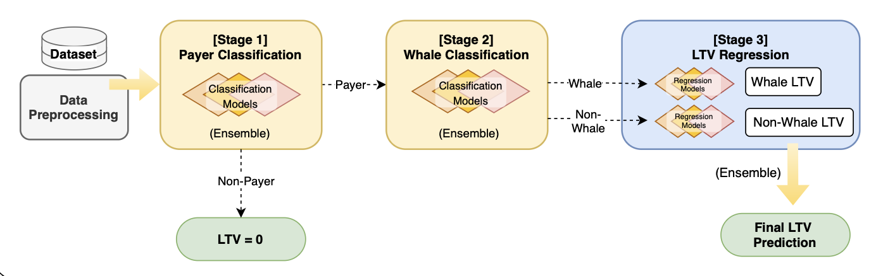

<h2 align='center'> LTV 추정의 편향성 감소를 위한 계층적 앙상블 모델링 연구

: 고가치 사용자의 전략적 식별을 중심으로
<h3 align='center'> A Hierarchical Ensemble Framework for Bias-Reduced Lifetime Value Estimation </h3>

    

<table>
    <thead>
        <tr>
            <th colspan="4"> First Author </th>
        </tr>
    </thead>
    <tbody>
        <tr>
          <tr>
            <td align='center'><a href="https://github.com/happysandwich0"></td>
            <td align='center'><a href="https://github.com/simlin01"></td>
            <td align='center'><a href="https://github.com/dongdiana"></td>
            <td align='center'><a href="https://github.com/Chaesoyeon"></td>
          <tr>
            <td align='center'>김유진</td>
            <td align='center'>심승현</td>
            <td align='center'>이동주</td>
            <td align='center'>채소연</td>
          </tr>
        </tr>
    </tbody>
</table>

    

        <h2>Abstract</h2>
        

  LTV(고객생애가치) 예측은 고객 세분화와 더불어 고객 확보, 유지 및 이탈 방지 전략을 수립하는 데 중심적인 역할을 해왔다. 그러나 대부분의 LTV 데이터는 본질적으로 긴 꼬리 형태의 분포를 가지며, 특히 비구매자의 비중이 압도적인 산업군에서는 고액 결제 구간을 과소 추정하는 등 특정 집단에 대한 예측 편향이 발생할 가능성이 높다.

  본 연구에서는 이러한 문제를 해결하기 위해 고가치 고객을 단계적으로 식별하는 계층적 앙상블 모델 구조를 제안한다. LTV 회귀 예측을 3단계로 구조화하여 고객 간의 이질성을 반영하며, 각 단계에서는 다음과 같이 수행한다. 첫 번째 단계에서는 구매 여부에 따라 구매자와 비구매자로 고객을 분류한다. 두 번째 단계에서는 구매자 중 Whale에 해당하는 고가치 고객군을 별도로 식별한다. 마지막 단계에서는 분류된 고객 유형별로 최적화된 개별 전문가 모델을 통해 LTV를 예측한다. 특히 불균형 데이터 환경에서 분류 성능을 확보하기 위해 재현율을 극대화할 수 있는 방법을 제시하며, 이를 통해 기업이 처한 데이터 상황에 맞춰 유연하게 적용할 수 있도록 한다. 마지막으로, 데이터 불균형이 극심한 게임 산업의 실제 사용자 행동 로그 데이터에 본 방법론을 적용하여 그 효용성을 검증한 결과를 함께 제시한다.
        

    

---

## Background
실제 산업 데이터의 LTV는 대부분 극단적인 긴 꼬리(long-tail) 분포를 가지며, 특히 비구매자(0 지출)가 다수를 차지하거나, 소수의 고가치 고객(Whale)이 매출 대부분을 점유하는 환경에서는 단일 회귀 모델이 평균값으로 수렴해 고액 구간을 체계적으로 과소추정하는 문제가 발생하기 쉽다.
이에 따라 고가치 고객을 효과적으로 식별해 LTV 추정 정확도를 높이고자 본 연구는 LTV 예측을 단일 회귀가 아닌 구매 고객 식별, 고가치 고객 식별, 유형별 가치 추정으로 구조적으로 분해한 단계적 프레임워크로 재정의한다.

## Objective
본 연구의 목표는 고객 이질성과 극단적 불균형이 공존하는 환경에서 LTV 과소추정을 완화하고, 초기 관측 정보만으로도 비즈니스 의사결정에 유용한 안정적 LTV 예측을 제공하는 것이다.

## Key Ideas
1. CatBoost, LightGBM, XGBoost(1단계), TabPFN(2단계, 3단계) 모델을 앙상블하여 단일 모델 의존성을 완화한다.
2. 계층적 모델링 구조를 통해 고가치 유저를 식별한다.
3. 이전 단계의 결과를 바탕으로 3단계에서 최종 LTV를 추정한다.

  

## Significance
* 구조적 편향 완화: LTV 예측을 단일 회귀로 처리할 때 나타나는 고액 구간 과소추정 문제를, 고객 집단을 단계적으로 분해하고 유형별 회귀를 적용함으로써 완화한다.
* 소수 표본 환경에서의 모델링 대안: TabPFN을 포함한 앙상블은 Whale과 같은 희소·고변동 집단에서 예측 안정성을 보완할 수 있음을 보이며, 극단적 long-tail 환경에서의 LTV 모델링에 실용적 대안을 제시한다.

